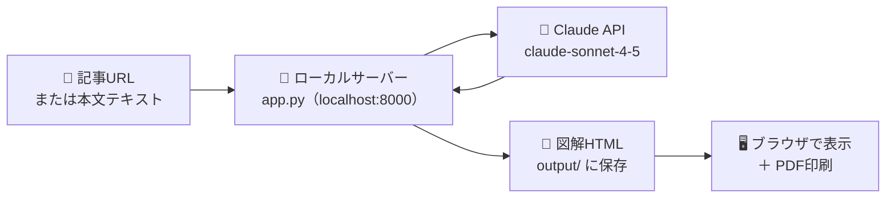
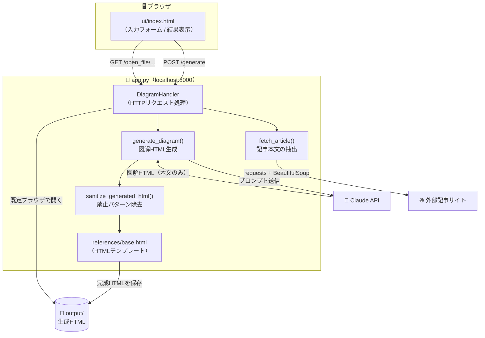
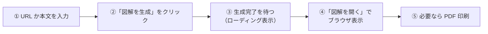
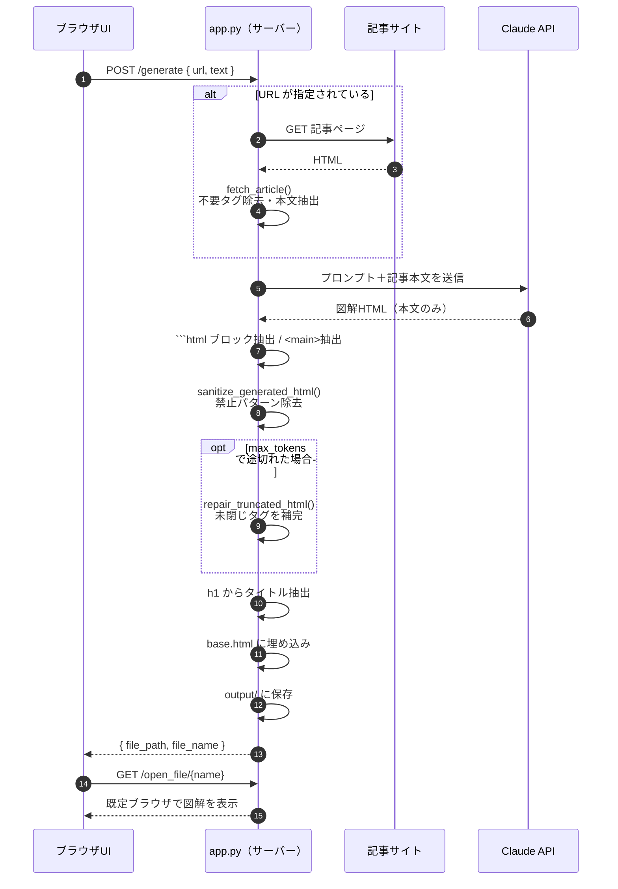
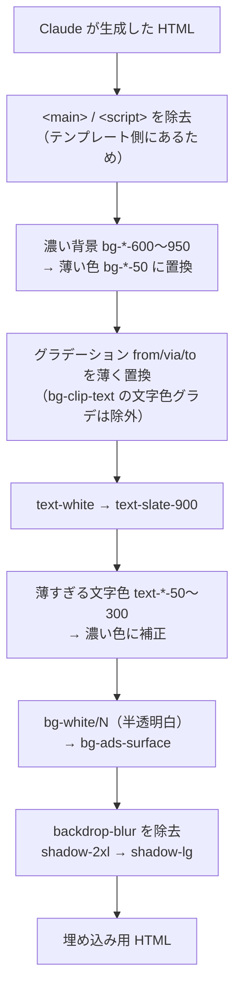
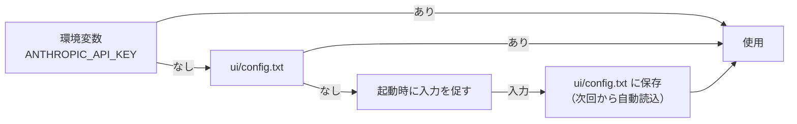

# 記事図解ジェネレーター — 仕様・使い方

長文記事を、直感的でわかりやすい **HTML 図解** に自動変換するローカルツールです。
Python スクリプト 1 本（[`app.py`](../app.py)）でローカルサーバーとブラウザ UI を起動し、Claude API で図解を生成します。

---

## 目次

1. [全体像](#全体像)
2. [システム構成](#システム構成)
3. [使い方](#使い方)
4. [生成フロー（詳細）](#生成フロー詳細)
5. [HTTP エンドポイント仕様](#http-エンドポイント仕様)
6. [HTML サニタイズ処理](#html-サニタイズ処理)
7. [ファイル構成](#ファイル構成)
8. [APIキーの扱い](#apiキーの扱い)
9. [技術仕様](#技術仕様)
10. [既知の制約・注意点](#既知の制約注意点)

---

## 全体像

記事の URL かテキストを入力すると、Claude が内容を分析して「一言結論・用語解説・かみ砕き解説」付きの図解 HTML を生成し、`output/` フォルダに保存します。
生成物はブラウザで開け、そのまま PDF 印刷も可能です。



---

## システム構成

1 プロセスの中に **HTTP サーバー** と **図解生成ロジック** が同居しています。
フロントエンド（[`ui/index.html`](../ui/index.html)）はそのサーバーから配信され、`fetch` で同じサーバーの API を叩きます。



---

## 使い方

### 1. 起動

フォルダ内でコマンドプロンプト（またはターミナル）を開き、次を実行します。

```cmd
python app.py
```

- 初回は必要なパッケージ（`anthropic` / `requests` / `beautifulsoup4`）が自動インストールされます。
- 初回のみ API キーの入力を求められます（→ [APIキーの扱い](#apiキーの扱い)）。
- 起動すると自動でブラウザが開き、`http://localhost:8000` に UI が表示されます。

### 2. 図解を生成



- **URL 入力**：記事 URL を貼ると本文を自動取得します。
  URL を入れた場合、テキスト欄は無視されます。
- **テキスト入力**：URL がない・取得できないサイトは、本文を直接貼り付けます。
- 生成物は `output/` に `（本文の先頭行・最大50文字）_（YYYYMMDD_HHMMSS）.html` の名前で保存されます。
  URL 入力時は取得した本文の、テキスト入力時は貼り付けたテキストの先頭行が使われます。
  先頭行が空の場合は `diagram_（日時）.html` になります。
  なお `<h1>` から抽出したタイトルはファイル名ではなく HTML の `<title>` に使われます（→ [テンプレートの仕組み](#テンプレートの仕組み)）。

### 3. 終了

- UI の「サーバーを停止」ボタン、またはコマンドプロンプトで `Ctrl+C`。

---

## 生成フロー（詳細）

「図解を生成」を押してから保存までの内部処理シーケンスです。



### Claude へのプロンプトで強制している 3 要素

生成 HTML には必ず以下が含まれるよう、プロンプトで指示しています。

| 要素 | 内容 |
|------|------|
| 📌 一言結論ボックス | 記事全体の結論を 1〜2 文で、冒頭に必ず配置 |
| 📖 用語解説 | 専門用語・地名・人名の初出時に解説を挿入 |
| 🔰 かみ砕き解説 | 複雑な因果のあとに、中学生でもわかる言い換えを挿入 |

このほか、ヒーロー / セクション見出し / フロー図 / 比較カード / テーブル / 数字カード / ポイントボックス / カードグリッド / タイムライン などのパターンを自由に組み合わせます（セクションは最大 5〜6 個）。

---

## HTTP エンドポイント仕様

すべて `localhost:8000` で待ち受けます。

| メソッド | パス | 説明 | レスポンス |
|----------|------|------|------------|
| GET | `/` , `/index.html` | UI（`ui/index.html`）を配信 | HTML |
| GET | `/open_file/{ファイル名}` | `output/` 内の図解を既定ブラウザで開く | JSON（`status` / `error`） |
| GET | その他 | 静的ファイル配信 | ファイル内容 |
| POST | `/generate` | `{ url, text }` を受け取り図解を生成・保存 | JSON（`file_path` / `file_name` または `error`） |
| POST | `/shutdown` | サーバーを停止 | JSON（`status: shutting down`） |

> 🔒 `/open_file/` はパストラバーサル対策済み。
> `output/` 配下に解決されないパスは `403` を返します。

---

## HTML サニタイズ処理

Claude の出力をテンプレートに埋め込む前に、`sanitize_generated_html()` が「テンプレートと重複する要素」「読みづらくなる禁止パターン」を機械的に除去・補正します。
これにより、**白背景で常に読みやすい図解**になるよう統一しています。
色の置換は HTML 全体への一括置換ではなく `class="..."` 属性ごとに行い、同じ要素が持つ他のクラスを見て判断します。



| 対象 | 変換 | 目的 |
|------|------|------|
| `<main>` / `<script>` | 削除 | テンプレートと二重化させない |
| `bg-*-600〜950` | `bg-*-50` | 濃い背景を禁止し白背景に統一 |
| `from-/via-/to-*-600〜950`<br/>（`bg-clip-text` + `text-transparent` を除く） | `from-*-50` / `via-*-100` / `to-*-50` | グラデーション背景も明るく。<br/>ただし `bg-clip-text` のグラデーションは背景ではなく**文字色**なので、薄くすると白背景に白文字となり見出しが消える。<br/>そのため除外して元の濃い色を保つ |
| `text-white` | `text-slate-900` | 白文字（白背景で消える）を禁止 |
| `text-*-50〜300` | 濃い色へ | 薄い文字を読めるように |
| `bg-white/N` | `bg-ads-surface` | 半透明白を実体のある薄グレーに |
| `backdrop-blur` | 削除 | 薄背景では不要 |
| `shadow-2xl` | `shadow-lg` | 影を穏やかに |

途中で出力が `max_tokens` に達して HTML が途切れた場合は、`repair_truncated_html()` が開いたままのタグをスタックで検出し、逆順に閉じて修復します。

---

## ファイル構成

```
10_記事要約/
├── app.py              # メインアプリ（サーバー＋生成ロジック）
├── README.md           # 概要
├── doc/
│   └── 仕様書.md        # このドキュメント
├── references/
│   └── base.html       # 図解HTMLテンプレート（Tailwind + Lucide + ads配色 + 印刷CSS）
├── ui/
│   ├── index.html      # Web UI（入力フォーム）
│   ├── config.txt      # APIキー保存（.gitignore対象）
│   ├── requirements.txt # 依存パッケージ
│   └── QUICKSTART.md   # かんたん起動ガイド
├── output/             # 生成された図解HTML（.gitignore対象）
└── _archive/           # 旧バージョン（.gitignore対象）
```

`output/`・`ui/config.txt`・`_archive/` は [`.gitignore`](../.gitignore) で除外され、Git 管理されません。

### テンプレートの仕組み

[`references/base.html`](../references/base.html) には差し込み用マーカーがあり、生成時に置換されます。

| マーカー | 置換される内容 |
|----------|----------------|
| `<!-- TITLE -->` | `<h1>` から抽出した記事タイトル |
| `<!-- CONTENT_START -->` 〜 `<!-- CONTENT_END -->` | サニタイズ済みの図解本文 |

マーカーが見つからない場合は例外を投げ、生成を中止します。

---

## APIキーの扱い

API キーは次の優先順で解決されます。



- 一度入力すれば `ui/config.txt` に保存され、次回以降は自動で読み込まれます。
- `config.txt` は `.gitignore` 対象なので、誤ってコミットされません。
- ⚠️ API キーは外部に公開しないでください。

---

## 技術仕様

| 項目 | 内容 |
|------|------|
| 言語 | Python 3.7+ |
| サーバー | 標準ライブラリ `http.server`（localhost:8000） |
| AI モデル | `claude-sonnet-4-5-20250929`（`max_tokens` 16000、beta: `output-128k-2025-02-19`） |
| 記事取得 | `requests` + `BeautifulSoup`（`article` / `main` / `[role="main"]` を優先、なければ `body`） |
| フロントエンド | Tailwind CSS（CDN）/ Lucide Icons / Noto Sans JP |
| 配色 | カスタムカラー `ads`（白背景・濃い文字に統一） |
| 依存パッケージ | `anthropic` / `requests` / `beautifulsoup4`（起動時に自動インストール） |

---

## 既知の制約・注意点

- **白背景・濃い文字に固定**：デザインの一貫性のため、濃い背景や白文字は機械的に除去されます。
  ダークテーマの図解は生成できません。
- **記事取得の限界**：JavaScript で本文を描画するサイトや、ログイン必須・有料記事は URL からうまく取得できないことがあります。
  その場合は本文を直接テキスト欄に貼り付けてください。
- **トークン上限**：非常に長い記事は `max_tokens` で途切れる可能性があります（未閉じタグは自動修復しますが、内容が末尾で欠ける場合があります）。
  プロンプト側でセクション数を 5〜6 個に絞って対処しています。
- **API 課金**：Claude API は従量課金です。
  生成のたびに費用が発生します。
- **著作権**：取得・図解化する記事の著作権に配慮して利用してください。
- **ポート固定**：`8000` 番ポート固定です。
  他プロセスが使用中だと起動に失敗します。
